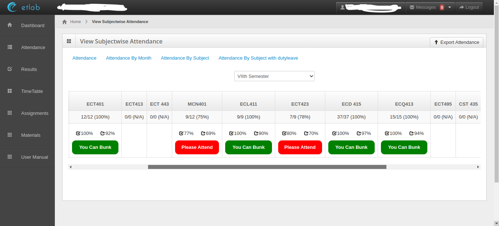
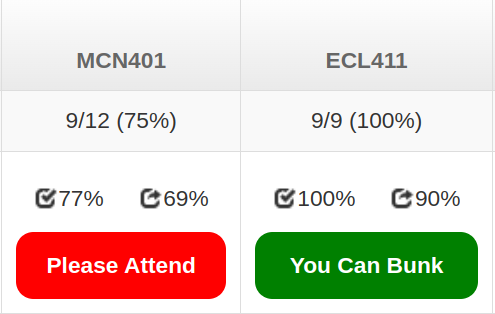
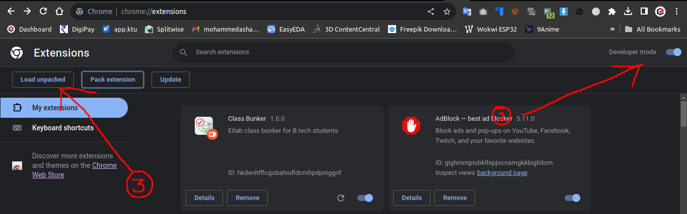
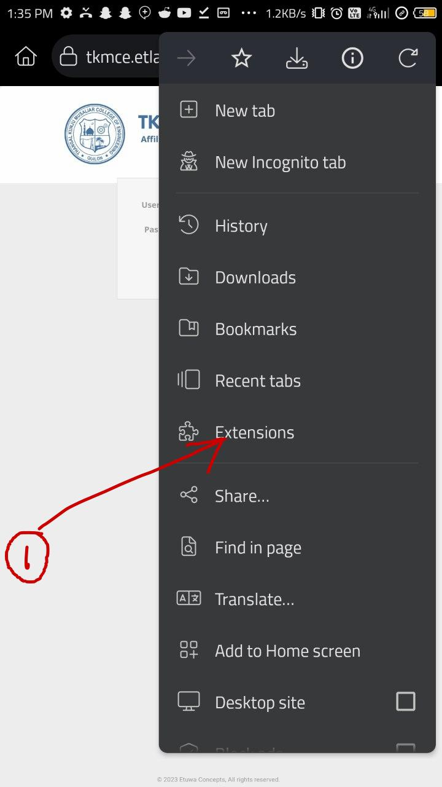
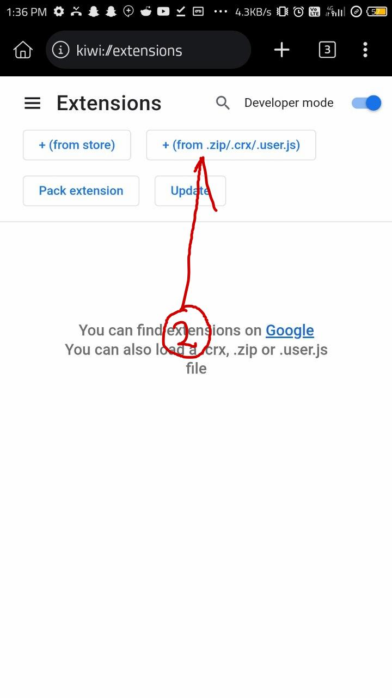
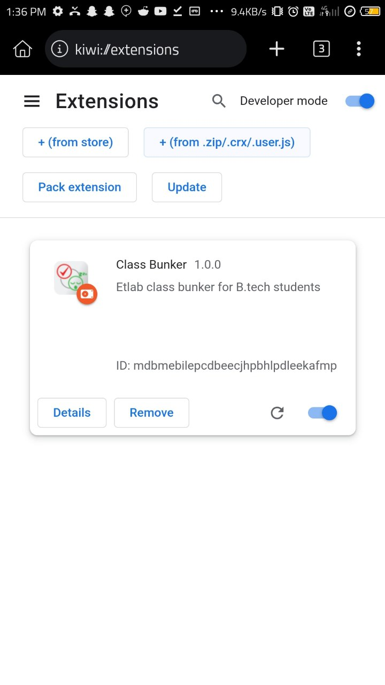

#  Class Bunker

> Chrome extension for optimizing student attendance decisions in Etlab

Class Bunker is a Chrome extension designed for B.Tech students using Etlab. It provides attendance insights by analyzing class attendance percentages and suggesting whether students can afford to bunk or should attend the next class. The extension calculates potential future attendance percentages, helping users make informed decisions about their class attendance strategy. Customize your study routine with Class Bunker to strike the perfect balance between attending classes and optimizing your schedule.

## Screenshots

## Release

*Changelog and release notes can be found in the [Releases](https://github.com/e-labInnovations/class-bunker/releases) section.*

## Install Locally

### 1. Download from Release Page
Visit the [Release Page](https://github.com/e-labInnovations/class-bunker/releases/latest) and download the latest release (e.g., `class-bunker-v1.0.0.zip`).

### Chrome
1. Open Chrome and navigate to the extensions page using this URL: `chrome://extensions`.
2. Enable "Developer mode".
3. Click the "Load unpacked extension" button, browse the `class-bunker-v1.0.0` directory, and select it.

### Android (Kiwi Browser)
1. [Install Kiwi Browser](https://play.google.com/store/apps/details?id=com.kiwibrowser.browser) from the Google Play Store.
2. Open the Kiwi Browser and navigate to `Extensions` page.
3. Select the `+ (from .zip/.crx/.user.js)` option.
4. Choose the downloaded zip file (`class-bunker-v1.0.0.zip`) to install the extension.

